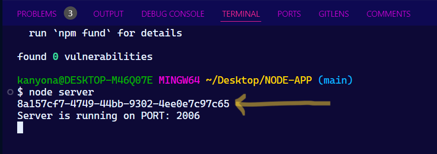

### Hi, This Repo [Author](https://github.com/jasurhaydarovcode)

#### Questions and suggestions `jasurhaydarovcode@gmail.com`

### You must have [NodeJs](https://nodejs.org/en/download/package-manager) installed to use these node packages

#### Available manuals
- nodemon
- uuid
- dotenv

#### PACKAGES

<!-- ================================================================ -->

---

#  nodemon 
[](https://npmjs.org/package/nodemon)

### **Why do you need nodemon?** 

| **If no nodemon**                                                                                                  | **with nodemon**                                                             |
|---------------------------------------------------------------------------------------------------------------|---------------------------------------------------------------------------|
| nodemon is a useful tool during development of Node.js applications that monitors changes in the application code and automatically reloads the server. | There is no need to manually restart the server every time developers make changes to your code. This speeds up the development process and increases efficiency. |


## 🌱 Install
```bash
npm install --save-dev nodemon
```

### `--save-dev` The reason this command is used is to drop our package into _devDependencies_

### and, script command

```json
 "scripts": {
    "nodemon": "nodemon server.js"
  },
```

## this run code

```bash
npm run nodemon
```

<!-- ================================================================ -->

---

#  UUID

### **Why do you need uuid?** 

- UUID (Universally Unique Identifier)
- For the creation of RFC4122 UUIDs

- Complete - Support for RFC4122 version 1, 3, 4, and 5 UUIDs
Cross-platform - Support for ...
CommonJS, ECMAScript Modules and CDN builds
NodeJS 12+ (LTS releases)
Chrome, Safari, Firefox, Edge browsers
Webpack and rollup.js module bundlers
React Native / Expo
Secure - Cryptographically-strong random values
Small - Zero-dependency, small footprint, plays nice with "tree shaking" packagers
CLI - Includes the uuid command line utility

## 🌱 Install
```bash
npm install uuid
```

### generate uuid (server.js)
```js
// 'uuid' package import
const { v4: uuidv4 } = require('uuid');

// UUID generate
const myUUID = uuidv4();

console.log('Generated UUID:', myUUID);

```

- In the example above, a new UUID is generated and output to the console by the v4 (version 4) function of the uuid package.

- There are other versions of the UUID, such as v1, v3, and v5, each with specific applications. But v4 is the most common and will be sufficient in most cases.

### run server
```bash
node server.js
```



### 


<!-- ================================================================ -->

---

#  dotenv [](https://www.npmjs.com/package/dotenv)

### **Why do you need dotenv?** 

| Benefits                         | Drawbacks                              |
|----------------------------------|----------------------------------------|
| **Configuration Management**: Easily manage and update environment variables stored in .env files. | **Security Risks**: Sensitive information in .env files can be exposed if not managed properly. |
| **Simplifies Code**: Configuration parameters are separated from code, making the code cleaner and easier to read. | **Local Storage**: .env files are stored as plaintext on disk, which can be risky for sensitive data. |
| **Flexibility**: Different .env files can be used for different environments (e.g., production, testing). | **Performance**: Loading the .env file on each application start can cause a delay in large projects. |
| **CI/CD Integration**: Simplifies management of environment variables in continuous integration and deployment processes. | **Reliability**: If the .env file is misconfigured or missing, the application may fail to run. |
| **Version Control**: Keeping .env files out of version control helps protect sensitive information. | **Testing and Production Mix**: Using the same .env file for both testing and production can lead to issues. |


## 🌱 Install
```bash
npm install dotenv
```

---